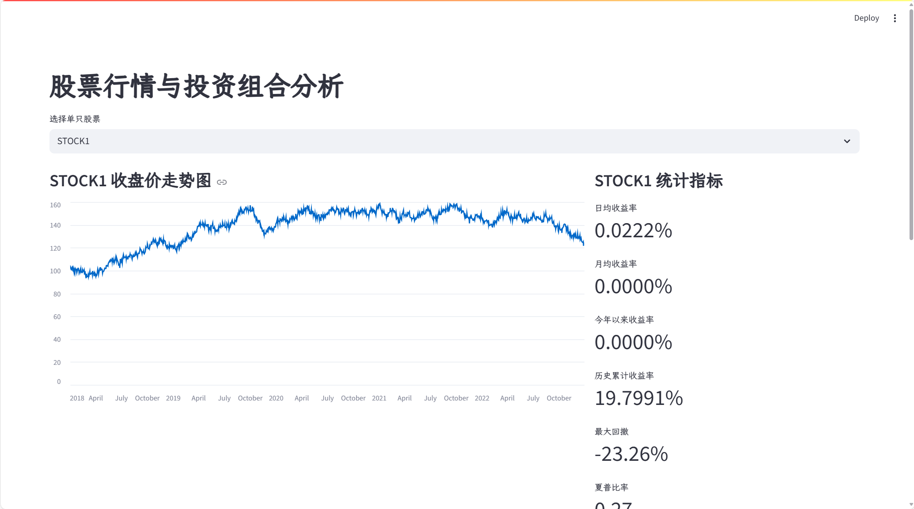

# streamlit_mock

## 项目简介

streamlit_mock 是一个基于 Streamlit 的股票数据统计模拟系统。该项目通过容器化部署，结合 MySQL 数据库，实现了股票行情数据的存储、用户登录认证及多维度的统计分析与可视化。



## 功能特性

- 用户登录（用户名密码存储于 MySQL，使用 Streamlit 登录模块，支持登录提示）
- 5 只模拟股票行情数据（5 年历史，包含股票代码、日期、开盘价、收盘价）
- 单只股票统计：
  - 日均、月均、今年以来、历史累计收益率
  - 最大回撤、夏普比率
- 投资组合（5 只股票等权持有）统计：
  - 日均、月均、今年以来、历史累计收益率
  - 最大回撤、夏普比率
  - 投资组合历史走势图
- 所有数据均存储于 MySQL，数据文件可持久化于容器外部

## 环境依赖

- 系统：Ubuntu 22.04（推荐，其他平台需适配 Docker 环境）
- Docker & Docker Compose
- MySQL 8.0
- Python 3.13

## 快速开始

```bash
git clone https://github.com/yeisme/streamlit_mock.git
cd streamlit_mock
```

### Docker Compose

```bash
docker compose up -d
```

在浏览器中打开 [http://localhost:8501](http://localhost:8501)

### Python/Streamlit

```bash
# 使用 uv 安装依赖
uv sync
# 或者使用 pip 安装
pip install -e .
```

```bash
python -m streamlit run src/main.py
```

### 登录

- 注册后登录后可查看股票统计与可视化页面

## 数据说明

- 股票行情数据为模拟生成，包含 5 年历史数据
- 用户名与密码信息存储于 MySQL
- 所有数据可通过挂载方式持久化于本地

## 统计指标说明

- 收益率：日均、月均、今年以来、历史累计
- 最大回撤：历史最大回撤率
- 夏普比率：收益与风险比
- 投资组合：5 只股票等权持有的整体表现

## 其他说明

- 如需自定义股票数据或用户信息，请修改初始化 Python 文件
- 如遇端口冲突或数据库连接问题，请检查 docker-compose 配置

---

如有问题请联系项目维护者。
